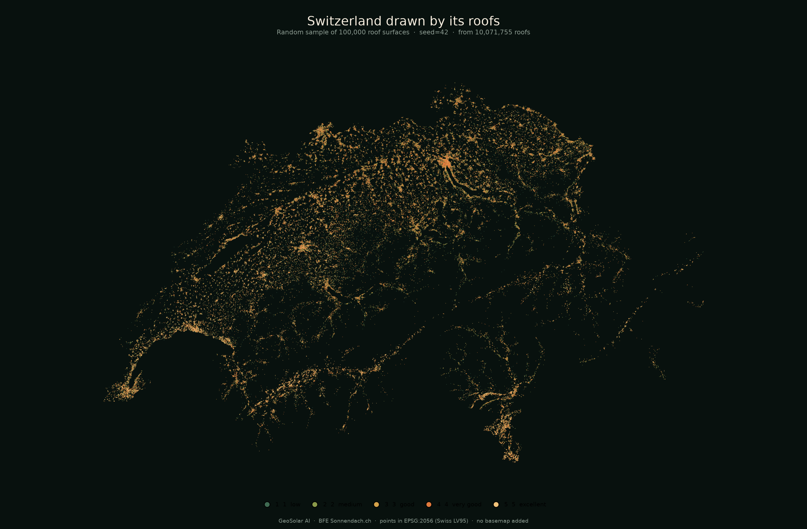

# GeoSolar AI

A dark **hex-cell** map of Swiss rooftop solar, with an **each-roof** view of 100,000 official Sonnendach.ch points. Interface in English, German, French, and Italian.

Built from a stratified sample of 10,071,755 roofs. No live API: the explorer is static JSON + Leaflet.



## Open

**https://alexanderduckworthhu.github.io/geosolar-ai/**

The explorer is static JSON + Leaflet on GitHub Pages. No API, no localhost.

To run a local copy:

```bash
cd frontend
python3 -m http.server 8000
```

| Control | |
| --- | --- |
| **EN / DE / FR / IT** | Interface language |
| **Hex 2.4 km / Each roof** | Neighbourhood cells, or one cadastre MultiPoint per sampled roof |
| **CH / city chips** | Zoom the hexagonal view |
| **Class floor** | Dim cells or roofs below that class |
| **Mean class / Class 4–5** | Colour by average suitability or by share of excellent roofs |
| Hover / click | Preview, then pin |

Feature walkthrough: `visuals/explorer_demo.mp4`

## Data

[*Eignung von Hausdächern für die Nutzung von Sonnenenergie*](https://opendata.swiss/de/dataset/eignung-von-hausdachern-fur-die-nutzung-von-sonnenenergie) — BFE / swisstopo / MeteoSwiss.

Hexes are binned in EPSG:2056 (2.4 km radius), then drawn in WGS84. The roof view plots the sample’s official coordinates. Rebuild maps:

```bash
python visuals/build_hex_explorer.py
python visuals/build_visuals.py --from-sample
python visuals/build_canton_map.py --from-cache
python visuals/build_demo.py
```

## Why not kWh

Official `KLASSE` is assigned from irradiation. Putting radiation in the UI would leak the label. The map shows geometry-driven neighbourhood mix from the cadastre itself.

## Also in this repo

| | |
| --- | --- |
| `visuals/` | Country, city, and canton stills / GIFs |
| `DATASET_REPORT.md` | Full FileGDB inspection |
| `training/` | Optional pipeline that produced the 100k sample |
